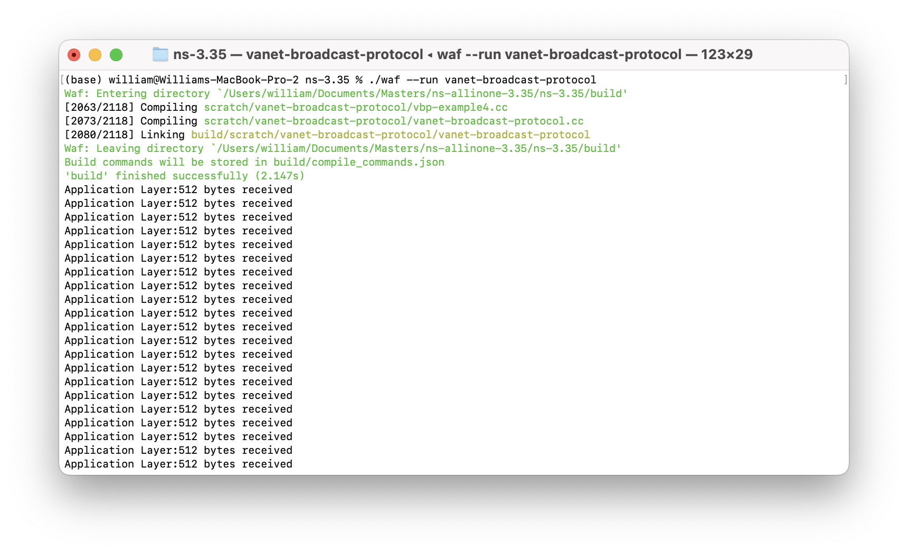
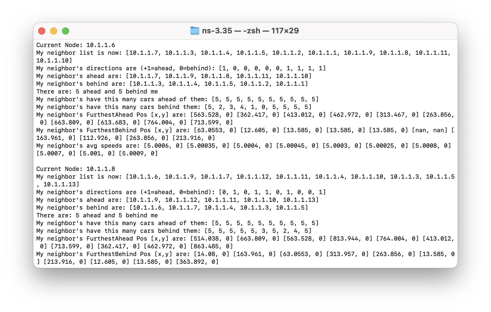

## VANET Broadcast Protocol

VANET Broadcast Protocol (VBP) is a framework that supports a dynamic, multi-hop routing protocol made for mobile and wireless vehicular networks. It is built on top of an open-source network simulator tool called [ns-3](https://www.nsnam.org/about/).

The goals of VBP are:

1. Develop a routing protocol that supports multi-hop capabilities and dynamic routing on a VANET for ns-3
    - Routing decisions based on traffic environment
    - Produce small end-to-end delay
    - Use internet layer of TCP/IP model
2. Provide simulation parameters and setup for ns-3
    - Test VBP funcitonality using simulations
    - Simulation code can be modified and debugged
3. Document the development of a custom routing protocol for ns-3
    - Did not find comprehensive documentation to create a routing protocol in ns-3


### Requirements
VBP was built using ns-3 version 3.35. ns-3 supports unix based enviornments and it is recommended to use a unix-based environment such as Linux or MacOS. Windows Subsystem for Linux (WSL) is also an option for Windows 10 or Windows 11 users. 

Please refer to ns-3's official [installation guide](https://www.nsnam.org/wiki/Installation) for instructions to install on your operating system

### Installation

```bash
git clone https://github.com/Intemnets-Lab/VANET-Broadcast-Protocol.git
cd VANET-Broadcast-Protocol
./build.py
```

Source files for VBP and examples can be found in the following directory
```bash
/ns-allinone-3.35/ns-3.35/scratch/vanet-broadcast-protocol/
```

### Installation on Newer Computers
see https://www.nsnam.org/wiki/Ns-3.35_errata
```bash
git clone https://github.com/Intemnets-Lab/VANET-Broadcast-Protocol.git
cd VANET-Broadcast-Protocol/ns-3.35/
./waf configure --disable-werror --nopyc --nopyo --nopycache --disable-python
./waf build
./waf --run vanet-broadcast-protocol
```


### Getting Started
VBP provides example simulation scripts in it's directory that shows how to use add VBP routing capabilities to nodes. This is useful for a those without prior knowledge of ns-3. Only one example script can be activated at a time. Comment out the scripts you do not wish to run.

For those who have used ns-3 previously, VBP can be added to simulation scripts in a similar manner to other routing protocols.
After calling <code>VanetBroadcastHelper</code> users must set the broadcast area (BA).
The BA is set through <code>SetBroadcastArea({$x_{1}$, $y_{1}$, $x_{2}$, $y_{2}$})</code> where ($x_1$, $y_1$) is the upper-left corner of the BA and ($x_2$, $y_2$) is the bottom-right corner of the BA. The $y-axis$ is inverted.

The following example shows how to call <code>VanetBroadcastHelper</code> and define <code>SetBroadcastArea</code> for specific coordinates. 
```c++
    InternetStackHelper stack;
    VanetBroadcastHelper vbp; //VanetBroadcastHelper
    vbp.SetBroadcastArea({100000, -10, 100050, 10});
    stack.SetRoutingHelper(vbp);
    stack.Install(nodes);
```

<center>

</center>


To run VBP, change directory to `ns-3.35`. 
```bash
./waf --run vanet-broadcast-protol
```


### Logging

We recommend enabling logging to debug and track VBP.  

Logging is enabled by setting the NS LOG environment variable prior to the command that compiles and runs the code.

```bash
$ NS_LOG="VanetBroadcastProtocol" ./waf --run vanet-broadcast-protocol
```


The code above runs all logging outputs that were expressed in the class VanetBroadcastProtocol.


$ NS_LOG="VanetBroadcastProtocol" ./waf --run vanet-broadcast-protocol


Log Severity Class:


| Log Severity Class | Description | 
| :---        |    :----:  |  
| LOG_NONE      | No logging    | 
| LOG_ERROR   | Serious messages that inform of cases where simulation may break |
| LOG_WARN   | Warning messages     |
| LOG_DEBUG   | Debugging messages   |
| LOG_INFO   | Informational   |
| LOG_FUNCTION   | Function tracking    |
| LOG_LOGIC   | Logic flow within functions  |


We can track log messages that appear at a severity class and above it. For example, the following code will track the 'Log Function' component found in various functions of VanetBroadcastProtocol. The output also shows log severity levels that are above Log\_Function, such as Log\_Error.


```bash
$ NS_LOG=VanetBroadcastProtocol=level_function ./waf --run vanet-broadcast-protocol
```

| Severity Level | Description | 
| :---        |    :----:  |  
| LOG_LEVEL_ERROR      | Output log error messages only  | 
| LOG_LEVEL_WARN     | Output log warn and log error messages only    | 
| LOG_LEVEL_DEBUG      | Output log debug and above messages only   | 
| LOG_LEVEL_INFO      |  Output log info and above messages only   | 
| LOG_LEVEL_FUNCTION      |  Output log function and above messages only    | 
| LOG_LEVEL_LOGIC      |  Output log logic and above messages only    | 
| LOG_ALL      | Output all log messages    | 


Using LOG\_Debug is useful for debugging because outputs include messages at high severities LOG_WARN and LOG_ERROR.


<center>

</center>


### Example Outputs & Useful Debugging Information

The examples that ships with VBP contain an application that prints out a message during a successful transmission.
```bash
Application Layer: 512 bytes received
```

Below is the expected output of a successful simulation.

<center>

</center>


We recommend looking for this output when running the example scripts. This is one indicator that the source application is received by the sink application by vehicles in the VANET.


#### Queue Size
Queue size is another metric users can look at to see that the routing protocol works as intended.
The output message is found in RoutingProtocol::EmptyQueue(). The queue is developed in class VbpQueue.


<center>

</center>


#### Neighbor List
The neighbor list output can show information such as the neighbors ahead, neighbors behind, number of neighbors and furthest neighbor.

The code that triggers this output is found in RoutingProtocol::SendHello() and the function that creates these messages is found in VbpNeighbor::PrintNeighborState().


<center>

</center>


