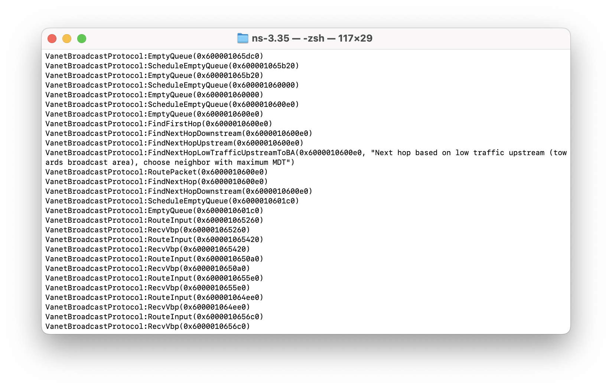
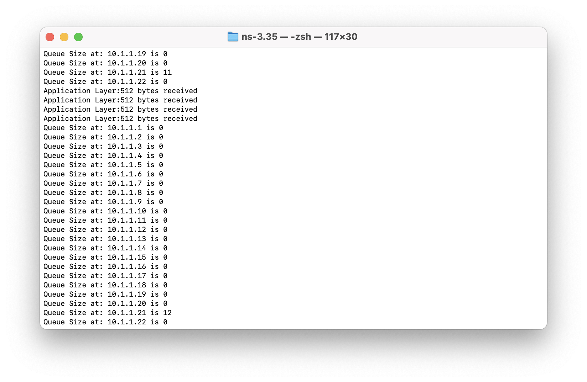

## VANET Broadcast Protocol

VANET Broadcast Protocol (VBP) is a framework that supports a wireless, multi-hop routing protocol made for vehicular networks. It is built on top of an open-source network simulator tool called [ns-3](https://www.nsnam.org/about/).

The goal of VBP is:

1. To provide a framework for researchers to test their routing algorithms on wireless, multi-hop network topologies. 
    a. Researchers can focus on implementing their routing algorithms on the routing layer of the TCP/IP wireless stack rather than implementing the wireless stack from scratch
2. To document minimal requirements for a user to set up their own wireless routing protocol in ns-3
3. To test our routing protocol using the VBP framework

For example, if a researcher has a custom routing algorithm, we provide a minimal way to test it.


Users can modify the existing routing protocol to test their own routing algorithms 

### Requirements
VBP was built using ns-3 version 3.35. ns-3 supports unix based enviornments and it is recommended to use a unix-based environment such as Linux or MacOS. Windows Subsystem for Linux (WSL) is also an option for Windows 10 or Windows 11 users. 

Please refer to ns-3's official installation guide for instructions to install on your operating system
https://www.nsnam.org/wiki/Installation


### Installation

```bash
git clone https://github.com/wmbjo/VANET-Broadcast-Protocol.git
cd ns-allinone-3.35
./build.py
```

Source files for VBP and examples can be found in the following directory
```bash
/ns-allinone-3.35/ns-3.35/scratch/vanet-broadcast-protocol/
```


### Getting Started
VBP provides example simulation scripts in it's directory that shows how to use add VBP routing capabilities to nodes. This is useful for a those without prior knowledge of ns-3.

For those who have used ns-3 previously, VBP can be added to simulation scripts in a similar manner to other routing protocols.
After calling <code>VanetBroadcastHelper</code> users must set the broadcast area (BA).
The BA is set through <code>SetBroadcastArea({$x_{1}$, $y_{1}$, $x_{2}$, $y_{2}$})</code> where ($x_1$, $y_1$) is the upper-left corner of the BA and ($x_2$, $y_2$) is the bottom-right corner of the BA. The $y-axis$ is inverted.

The following example shows how to call <code>VanetBroadcastHelper</code> and define <code>SetBroadcastArea</code> for specific coordinates. 
```c++
    InternetStackHelper stack;
    VanetBroadcastHelper vbp; //VanetBroadcastHelper
    vbp.SetBroadcastArea({100000, -10, 100050, 10});
    stack.SetRoutingHelper(vbp);
    stack.Install(nodes);
```

<center>

</center>


To run VBP, change directory to `ns-3.35`. 
```bash
./waf --run vanet-broadcast-protol
```


### Logging

We recommend enabling logging to debug and track VBP.  

Logging is enabled by setting the NS LOG environment variable prior to the command that compiles and runs the code.

```bash
$ NS_LOG="VanetBroadcastProtocol" ./waf --run vanet-broadcast-protocol
```


The code above runs all logging outputs that were expressed in the class VanetBroadcastProtocol.


$ NS_LOG="VanetBroadcastProtocol" ./waf --run vanet-broadcast-protocol


Log Severity Class:


| Log Severity Class | Description | 
| :---        |    :----:  |  
| LOG_NONE      | No logging    | 
| LOG_ERROR   | Serious messages that inform of cases where simulation may break |
| LOG_WARN   | Warning messages     |
| LOG_DEBUG   | Debugging messages   |
| LOG_INFO   | Informational   |
| LOG_FUNCTION   | Function tracking    |
| LOG_LOGIC   | Logic flow within functions  |


We can track log messages that appear at a severity class and above it. For example, the following code will track the 'Log Function' component found in various functions of VanetBroadcastProtocol. The output also shows log severity levels that are above Log\_Function, such as Log\_Error.


```bash
$ NS_LOG=VanetBroadcastProtocol=level_function ./waf --run vanet-broadcast-protocol
```

| Severity Level | Description | 
| :---        |    :----:  |  
| LOG_LEVEL_ERROR      | Output log error messages only  | 
| LOG_LEVEL_WARN     | Output log warn and log error messages only    | 
| LOG_LEVEL_DEBUG      | Output log debug and above messages only   | 
| LOG_LEVEL_INFO      |  Output log info and above messages only   | 
| LOG_LEVEL_FUNCTION      |  Output log function and above messages only    | 
| LOG_LEVEL_LOGIC      |  Output log logic and above messages only    | 
| LOG_ALL      | Output all log messages    | 


Using LOG\_Debug is useful for debugging because outputs include messages at high severities LOG_WARN and LOG_ERROR.


<center>

</center>


### Example Outputs & Useful Debugging Information


#### Queue Size


<center>

</center>


#### Neighbor List


#### Packet Type


#### Local Delivery


Applcation Layer: 512 bytes received


