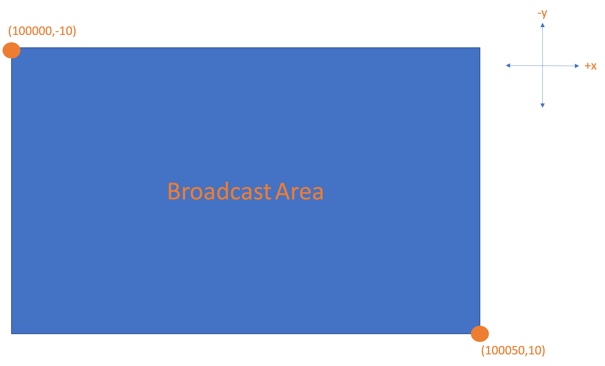

# VANET Broadcast Protocol
 VBP

VANET Broadcast Protocol (VBP) is a multi-hop routing protocol made for vehicular networks. It is built on top of an open source network simulator tool called [ns-3](https://www.nsnam.org/about/).

### Installation

```bash
git clone https://github.com/wmbjo/VANET-Broadcast-Protocol.git
cd ns-allinone-3.35
./build.py
```

Source files for VBP and examples can be found in the following directory
```bash
/ns-allinone-3.35/ns-3.35/scratch/vanet-broadcast-protocol/
```

VBP can be added to simulation scripts in a similar manner to other routing protocols.
After calling <code>VanetBroadcastHelper</code> users must set the broadcast area (BA).
The BA is set through <code>SetBroadcastArea({$x_{1}$, $y_{1}$, $x_{2}$, $y_{2}$})</code> where ($x_1$, $y_1$) is the upper-left corner of the BA and ($x_2$, $y_2$) is the bottom-right corner of the BA. The $y-axis$ is inverted.

The following example shows how to call <code>VanetBroadcastHelper</code> and define <code>SetBroadcastArea</code> for specific coordinates. 
```c++
    InternetStackHelper stack;
    VanetBroadcastHelper vbp; //VanetBroadcastHelper
    vbp.SetBroadcastArea({100000, -10, 100050, 10});
    stack.SetRoutingHelper(vbp);
    stack.Install(nodes);
```

<center>

</center>

